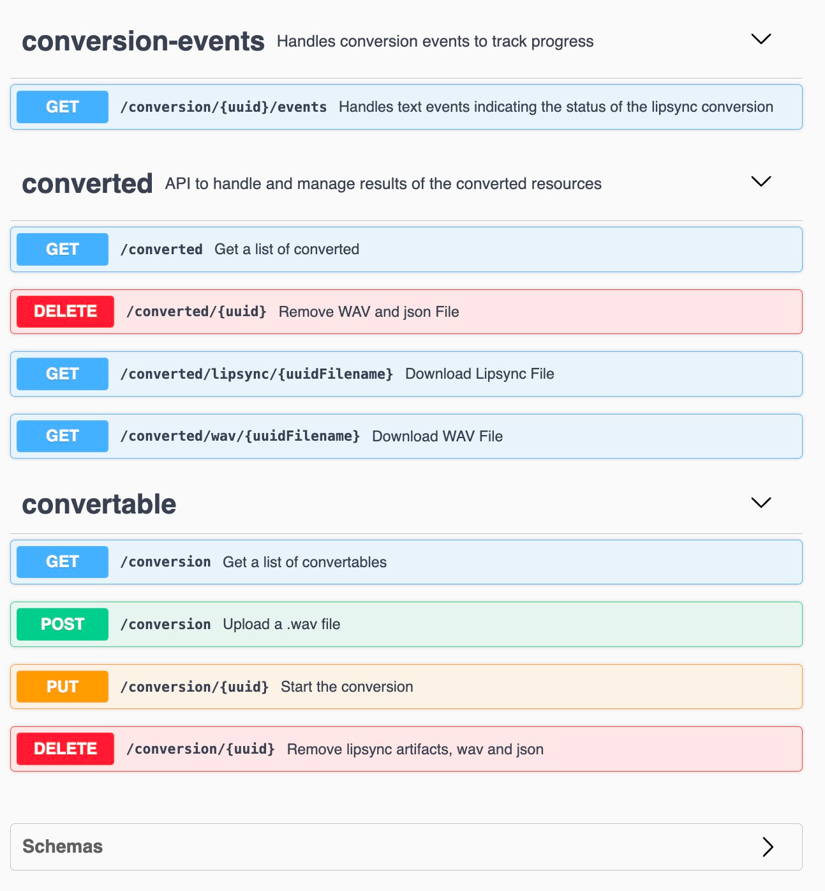
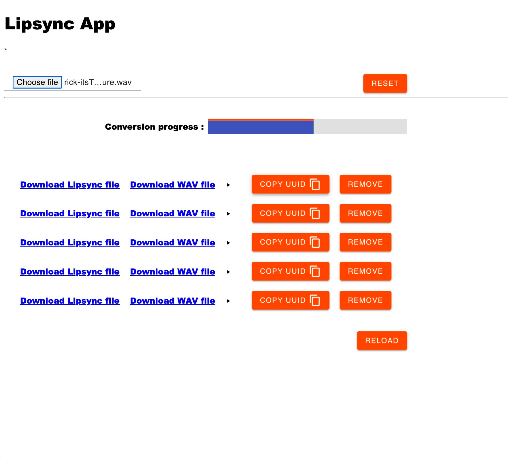

## Open API page

Visit this for overview of Rest API
```sh
http://localhost:9180/swagger-ui/index.html
```



## Simple GUI to test the service

```sh
http://localhost:9180/index.html
```

This will show a very basic but usable frontend to upload WAV files...
And convert them into Rhubarb's lipsync json as a result. 



## Docker image for x64 (Intel based computers)

Create a docker with this command :

```
export JAVA_HOME=~/Library/Java/JavaVirtualMachines/temurin-17.0.7/Contents/Home 
export JAVA_HOME=~/Library/Java/JavaVirtualMachines/azul-17.0.6/Contents/Home 
./gradlew clean build
docker build --no-cache -t  franzzle/lipsync-flux-api:0.0.1 .
```

## Docker image for arm64 (Arm based machines like Apple silicon, Chromebooks and Thinkpads)

```
docker buildx create --use
docker buildx build --platform linux/arm64 --output=type=local,dest=./out -f DockerfileM1 -t lipsync-flux-api-arm:0.0.1 .
docker buildx build --platform linux/arm64 --load -t lipsync-flux-api-arm:0.1.1 -f DockerfileM1 .
```

At the moment it does not work because these libs are not present :
qemu-x86_64: Could not open '/lib64/ld-linux-x86-64.so.2': No such file or directory


## Docker compose run

```sh
docker-compose up lipsync
```

Dependencies 

## Whisper Docker
When using the transcribing of audio it is easiest to use the Docker release of Whisper.
Whisper is A locally run tool that you can use to convert your audio into text. 
Very handy if you want to copy/paste this text through pipeline.

```sh
docker run -d -p 9000:9000 -e ASR_MODEL=base onerahmet/openai-whisper-asr-webservice:latest
```

Set the url to the whisper service (supporting Open API) and it will work (with WAV's)

```
speech.recognition.api.url=http://localhost:9000/asr
```

Open API Docs for whisper 

```
http://localhost:9000/docs
```


## Improvements

 * Finish OpenAPI Error situations including implementation
 * Fix security issues (while still keeping it basic)
 * Add SFL4J logging
 * Improve test coverage of code
 * Docker should run with a specific user, not root
 * MDC Web Styling is very basic and could be improved with paging and layout is poor 
 * Improve documentation